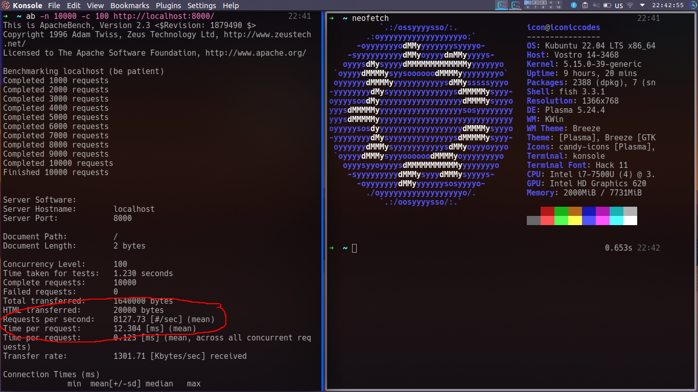

# LightRouter

A Fast, Easy and Lightweight Router for PHP. It also supports middlewares. During tests, it ran 8000+ requests per second.



## About Author
[Nabeel Ali](https://iconiccodes.com)

Website: [https://iconiccodes.com](https://iconiccodes.com)

Email: [mail2nabeelali@gmail.com](mailto:mail2nabeelali@gmail.com)

## Features

    * Fast
    * Easy
    * Lightweight
    * Supports Middlewares
    * Supports Dynamic Routes
    * Supports GET, POST, PUT, DELETE, PATCH, OPTIONS, HEAD
    * Handles Custom Responses (user nabeelalihashmi/LightHttp Package)


## Installtion
```
composer require nabeelalihashmi/lightrouter
```
Optional use LightHttp package for custom responses
```
composer require nabeelalihashmi/lighthttp

```

## Basic Usage

Create a new file `.htaccess` in your project root directory. 
```
Options -Indexes
RewriteEngine On
RewriteCond %{REQUEST_FILENAME} !-f
RewriteCond %{REQUEST_FILENAME} !-d
RewriteRule . public/index.php [L]
```
Here is sample code for index.php

```
<?php
function getRoutes()
{
    return [
        ['GET', '/', [HomeController::class, 'index'], []],
        ['POST', '/', [HomeController::class, 'posts'], [LoginCheck::class]],
        ['GET', '/user/someuser/icon', [HomeController::class, 'index'], [LoginCheck::class]],
        ['GET', '/user/.+', [HomeController::class, 'user'], [LoginCheck::class]]
    ];
}


$router = new Router;
$router->setRoutes(getRoutes());
$router->setNotFound(function() {
    header('HTTP/1.1 404 Not Found');
    echo '404 Not Found';
});

$router->run();
```
Here is demo Controller

```
<?php

namespace App\Controllers;

class HomeController
{
    public function index()
    {
        echo 'Hi';
    }

    public function posts() {
        echo 'My posts';
    }

    public function user($id) {
        echo 'Here';
        var_dump($id);
    }
}
```

Here is demo Middleware
```
<?php

namespace App\Middlewares;

use IconicCodes\LightRouter\IMiddleware;

class LoginCheck implements IMiddleware{
    public function handle() {
        return true;
    }
}
```

## Routing

### Execution
```
Request -> Before Middlewares -> Callback -> After Middlwares
```

You can add routes by following methods

1. `setRoutes`
2. `addRoute`

But first you need to know about a route structure. In LightRouter, a route structure is an array with this pattern

```
[
    'METHOD | String',
    'URI | String',
    'CALLBACK | Array or Callback',
    'BEFORE_MIDDLEWARES | Array'
    'After_MIDDLEWARES | Array'
]
```

you can either set routes one by one like:

```
$router->addRoute('GET', '/', [HomeController::class, 'index'], [MyMiddleware::class]);
```
or You can set all routes at once using `setRoutes` method like this

```
$router->setRoutes([
    ['GET', '/', [HomeController::class, 'index'], [MyMiddleware::class]],
    ['POST', '/', [HomeController::class, 'posts'], [MyMiddleware::class]],
    ['GET', '/user/someuser/icon', [HomeController::class, 'index'], [MyMiddleware::class]],
    ['GET', '/user/.+', [HomeController::class, 'user'], [MyMiddleware::class]]
]);
```

## Dynamic Routes

LightRouter supports dynamic routes. You can use `.+` in your URI, and in callback function, you can use variables according to position.

```
$router->addRoute('GET', '/user/{arg1}/{arg2}', [HomeController::class, 'user'], [MyMiddleware::class]);

class HomeController {
    public function user($id, $name) {
        var_dump($id);
        var_dump($name);
    }
}
```

## Responses
## NOTE: Reponses are removed from LightRouter packages and they are part of LightHttp

To make it modular and independant, you can plug LightHttp IResponse or use own.

```
$router->response_type_interface_name = gettype('IconicCodes\LightHttp\Responses\IResponse);
```

You can make your own reponse handler too. It must have 'handle' method.

<s>
Controllers/callbacks can return a Response implementing `IResponse` interface having `handle` method. By default LightRouter has these Responses

*   LResponse
*   LJSONResponse
*   LRedirectResponse
</s>

## Methods

LightRouter has only these methods:

### setRoutes(array $routes)
```
$router->setRoutes([...]);
```
### addRoute($array route)
```
$router->addRoute('GET', '/', [HomeController::class, 'index'], [MyMiddleware::class]);
```
### run()
```
$router->run();
```
### setNotFound(callback $callback)
```
$router->setNotFound(function() {
    header('HTTP/1.1 404 Not Found');
    echo '404 Not Found';
});
```

-------------------------

## License

LightRouter is released under permissive licese with following conditions:

* It cannot be used to create adult apps.
* It cannot be used to gambling apps.
* It cannot be used to create apps having hate speech.

### MIT License

Copyright 2022 Nabeel Ali | IconicCodes.com

Permission is hereby granted, free of charge, to any person obtaining a copy of this software and associated documentation files (the "Software"), to deal in the Software without restriction, including without limitation the rights to use, copy, modify, merge, publish, distribute, sublicense, and/or sell copies of the Software, and to permit persons to whom the Software is furnished to do so, subject to the following conditions:

The above copyright notice and this permission notice shall be included in all copies or substantial portions of the Software.

THE SOFTWARE IS PROVIDED "AS IS", WITHOUT WARRANTY OF ANY KIND, EXPRESS OR IMPLIED, INCLUDING BUT NOT LIMITED TO THE WARRANTIES OF MERCHANTABILITY, FITNESS FOR A PARTICULAR PURPOSE AND NONINFRINGEMENT. IN NO EVENT SHALL THE AUTHORS OR COPYRIGHT HOLDERS BE LIABLE FOR ANY CLAIM, DAMAGES OR OTHER LIABILITY, WHETHER IN AN ACTION OF CONTRACT, TORT OR OTHERWISE, ARISING FROM, OUT OF OR IN CONNECTION WITH THE SOFTWARE OR THE USE OR OTHER DEALINGS IN THE SOFTWARE.

